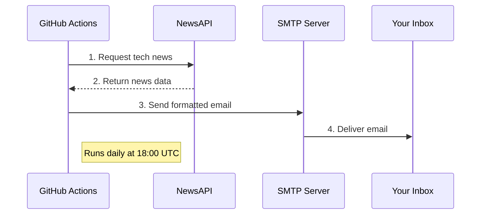

# 📰 Daily News Email Bot

[](https://github.com/arassp/daily-news-bot/actions)
 


## ✔️ About 
A totally automated GitHub actions workflow that emails you daily tech (or any other category) news summaries to your inbox using GitHub Actions, NewsAPI, and SMTP. 

## ⚙️ Program Workflow 


## ✨ Features
### 📩 Automated Daily Tech News Delivery
- Fetches the **top 5 trending tech news articles** daily from **[NewsAPI.org](https://newsapi.org/)**.
- Can be modified to fetch **different news categories**.
- Sends you a daily **email** with article summaries and links.
- Runs **daily at 08:00 UTC** via **GitHub Actions**.
  
### 🔐 Secure Email Handling
- Uses **SMTP authentication** to send emails securely.
- Supports **Gmail, Outlook, Yahoo, and custom SMTP servers**.
- Email credentials are stored **securely** in **GitHub Secrets**.
  
### ⚡ Automated Integration with GitHub Actions
- Runs automatically **without manual actions**.
- But can also be manually triggered via **GitHub Actions workflow dispatch**.
- Hosted on **GitHub’s free CI/CD runners**.
  
### ⚠️ Error Handling and Logging
- **Catches API failures** (i.e., network issues, API rate limits).
- Logs the error messages for debugging.
- Provides **warnings** if no news articles are found.
  
## 🚀 Setup & Configuration

### **1️⃣ Add API Key & SMTP Credentials as GitHub Secrets**
Go to **Settings > Secrets and variables > Actions** and add:
| Secret Name       | Value |
|------------------|-------------|
| `NEWSAPI_KEY` | Your NewsAPI key (https://newsapi.org). |
| `SENDER_EMAIL` | Your email address for sending news. |
| `RECEIVER_EMAIL` | The recipient’s email address. |
| `SMTP_SERVER` | SMTP server (i.e., `smtp.gmail.com`). |
| `SMTP_PORT` | SMTP port (`465` for SSL or `587` for TLS). |
| `SMTP_PASSWORD` | Your email password or app password. |
---
### **2️⃣ Modify GitHub Actions Workflow (`.github/workflows/schedule.yml`)**
- Update the **schedule.yml** if needed (default is **08:00 UTC daily**).
- Modify environment variables if using a different/custom SMTP provider.
---
### **3️⃣ Test the Workflow**
- The workflow runs automatically at **08:00 UTC**.
- But you can also **manually trigger** it under **GitHub Actions > Run Workflow**.
---
## 📰 How to Change The News Category 
You can change news category by modifying the **NewsAPI query** in the `main.py` script.
Open `main.py` and locate this line:
```python
category = "technology"
```
Possible categories with NewsAPI are:  `business`, `entertainment`, `general`, `health`, `science`, `sports`, and `technology`.

## FAQs❓
<details>
<summary>1. Can I change the frequency of the email updates?</summary>
    Yes, just open <code>schedule.yml</code> and modify the <code>cron</code> schedule to change the timing.
    <br>
    Example for hourly runs: <code>- cron: '0 * * * *'</code>
    </br>
</details>
<details>
<summary>2. Can I use this bot with other news APIs?</summary>
    Yes, but you’ll need to modify the <code>get_news()</code> function in <code>main.py</code> to make API requests to the new service and parse their response format.
</details>
<details>
<summary>3. Can I customize the email content?</summary>
    Yes, just edit the <code>get_tech_news()</code> or <code>send_email()</code> functions in <code>main.py.</code> You can change the formatting, number of articles, or add new details to the email body.
</details>
<details>
<summary>4. Can I host this on a local machine instead of GitHub Actions?</summary>
    Yes, install the required dependencies and set up a <code>cron</code> job to run <code>main.py</code> on your local machine. Use a <code>.env</code> file to manage your credentials securely.
</details>
<details>
<summary>5. How do I set up my email credentials securely?</summary>
    Store your credentials (<code>STMP_SERVER</code>,<code>NEWSAPI_KEY</code>,etc...) in GitHub Secrets as shown in the setup and configuration steps above.
    <br>
    IMPORTANT: <b>NEVER</b> hard-code any sensitive information directly in your code. 
    </br>
</details>
<details>
<summary>6. How is SMTP security handled, and is it safe to store sensitive information in GitHub Secrets? </summary>
    SMTP credentials (such as email, password, server, and port number) are stored securely in GitHub Secrets, which are encrypted and accessible only as environment variables during workflow action. You can also use this bot with an email address that you don’t frequently use (<code>SENDER_EMAIL</code>) while adding your primary email (<code>RECEIVER_EMAIL</code>) address as the recipient in GitHub Secrets. Steps for this are shown in the setup and configuration steps above. And while it may not always be necessary, I recommend using App Passwords instead of your actual email password for added protection. 
</details>
<details>
<summary>7. What are App Passwords? </summary>
    App Passwords are platform-specific passwords that allows third-party apps (like this bot) to access your email account without exposing your main account password.
    <table>
  <thead>
    <tr>
      <th>Provider</th>
      <th>Steps to Generate App Password</th>
    </tr>
  </thead>
  <tbody>
    <tr>
      <td><strong>Gmail</strong></td>
      <td>
        <ol>
          <li>Go to <a href="https://myaccount.google.com/security" target="_blank">Google Account Security</a>.</li>
          <li>Enable <strong>2-Step Verification</strong> if not already enabled.</li>
          <li>Under "Signing in to Google," select <strong><a href="https://myaccount.google.com/apppasswords" target="_blank">App Passwords</a></strong>.</li>
          <li>Give it any name, but something that you recognize and click <b>Generate</b></li>
          <li>Copy the password (delete the spaces) and add it to your <code>SMTP_PASSWORD</code> secret in GitHub.</li>
        </ol>
      </td>
    </tr>
    <tr>
      <td><strong>Outlook/Hotmail</strong></td>
      <td>
        <ol>
          <li>Go to <a href="https://account.live.com/proofs/manage" target="_blank">Microsoft Account Security</a>.</li>
          <li>Enable <strong>Two-Step Verification</strong> if not already enabled.</li>
          <li>Select <strong>Create a New App Password</strong>.</li>
          <li>Copy the password and add it to your <code>SMTP_PASSWORD</code> secret in GitHub.</li>
        </ol>
      </td>
    </tr>
    <tr>
      <td><strong>Yahoo Mail</strong></td>
      <td>
        <ol>
          <li>Go to <a href="https://login.yahoo.com/account/security" target="_blank">Yahoo Account Security</a>.</li>
          <li>Enable <strong>Two-Step Verification</strong>.</li>
          <li>Click <strong>Generate App Password</strong>, then select <strong>Other</strong> and give it a name.</li>
          <li>Copy the password and add it to your <code>SMTP_PASSWORD</code> secret in GitHub.</li>
        </ol>
      </td>
    </tr>
  </tbody>
</table>
</details>
<details>
<summary>8. Is it possible to use this bot with multiple recipients? </summary>
    Yes, but with some modification. First, you need to add the recipients to <code>RECEIVER_EMAIL</code> in GitHub secrets, seperated by commas. Let's say you have: example1@gmail.com, example2@gmail.com. Then you need to modify the <code>send_email</code> function in <code>main.py</code> so that it can handle multiple recipients. Now, the below line splits the <code>receiver_email</code> string (Stored in GitHub Secrets) into a list of email addresses, allowing you to handle multiple recipients.
<pre>
<code>
recipients = email_config['receiver_email'].split(",") 
</code>
</pre>
Now add a loop to send emails to each recipient individually.
<pre>
<code>
    for recipient in recipients:
    recipient = recipient.strip()  # Remove spaces
    msg['To'] = recipient
    server.send_message(msg)
    logging.info(f"Email sent to {recipient}")
</code>
</pre>
And a log message for each recipient for debugging 
<pre>
<code>
    logging.info(f"Email sent to {recipient}")
</code>
</pre>
</details>
<details>
<summary>9. What if there are no articles available in the selected category?</summary>
    The bot will log a warning: <code>No articles found for category: <category></code> and skip sending the email.
</details>
<details>
<summary>10. Can I change the number of news articles in the email?</summary>
    Yes, modify the <code>[:5]</code> in the <code>get_news()</code> function to your desired number of articles. 
    <br>
    Example: <code>articles = response.json().get('articles', [])[:10]  # Gets top 10 articles</code>
    </br>
</details>
<details>
<summary>11. Can I change the email format to HTML instead of plain text?</summary>
    Yes, modify the <code>send_email()</code> function and change the email body format from plain to html.
</details>

## 👏 Support 
Feel free to contribute, suggest improvements, or submit PRs.
<br>
If you found the project helpful, I'd appreciate a follow :) 
[](https://github.com/arassp)
</br>
